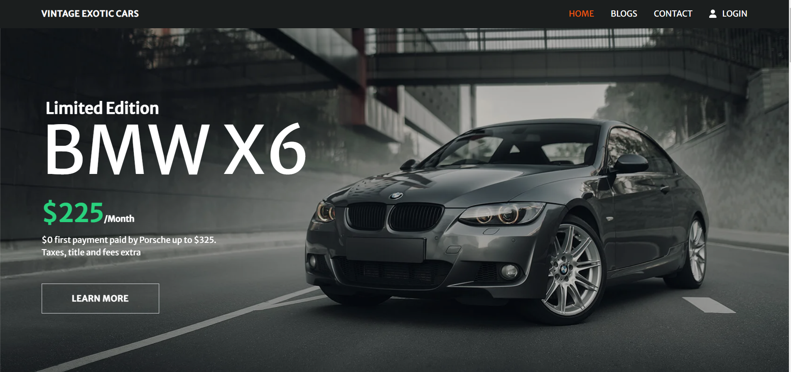

# [VINTAGE EXOTIC CARS](https://warehouse-management-54c43.web.app/)
<h1 align='center'>
    <a href='https://warehouse-management-54c43.web.app/' target='_blank'>
        VINTAGE EXOTIC CARS
    </a>
</h1>

    <b> VINTAGE EXOTIC CARS is a warehouse management website of cars. </b>

    

### Client Side Link : [https://github.com/Tasnim-Pricila/warehouse-management-client-side](https://github.com/Tasnim-Pricila/warehouse-management-client-side)
### Backend Side Link : [https://github.com/Tasnim-Pricila/warehouse-management-server-side](https://github.com/Tasnim-Pricila/warehouse-management-server-side) 
## Website Live-Link : [https://warehouse-management-54c43.web.app/](https://warehouse-management-54c43.web.app/) 

## **Project Description**

### **Tools and Technologies Used** :

* HTML
* CSS
* Tailwind
* React JS
* Node Js
* Express Js
* MongoDB
* Firebase
* Render

### **About Project** :

1. This is a Single-Page-Application website of Cars Warehouse Management.
2. Cars data is stored in the MongoDB Database.
3. There are three private routes(Manage Inventory, Add Items, and My Items) that can be seen if a user is logged in.
4. On the home page, there is a header, banner, services, Inventory, about us, and footer section.
5. If the user clicks on the update stock button from the inventory section he or she will go to the car details page and can update the quantity of a car.
6. On the Manage Inventories page user can delete a car by clicking on the delete button.
7. On add items page user can add a new car.
8. On my items page user can see the cars added by him or her and also delete or update quantity of any item if wanted.
9. Blogs page includes four questions and answers.
10. Contact page includes details about our contact addresses.

